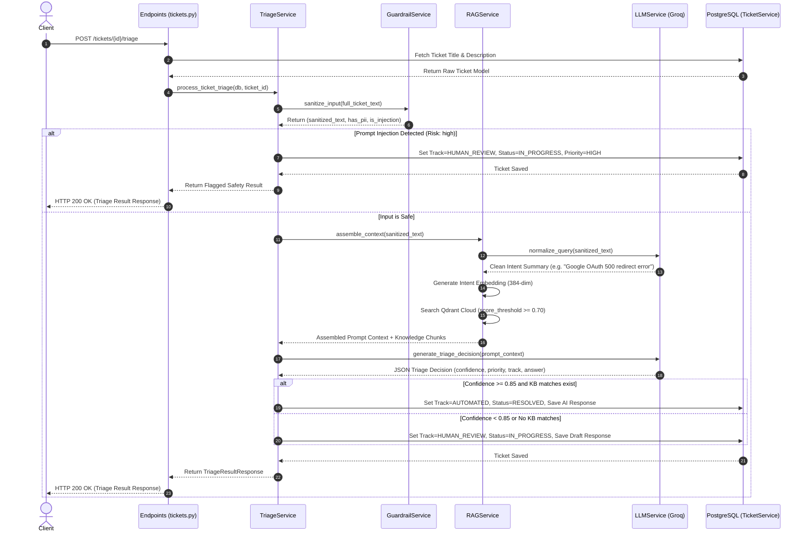

# SupportFlow AI Core & Vector Knowledge Engine — Module 2 Architecture

This document specifies the sequence flows, pipeline transformations, and architectural layers built in **Module 2 (Sessions 8 to 12)** for B2B customer support ticket auto-triage.

---

## 1. Complete AI & RAG Pipeline Flow

```mermaid
flowchart TD
    subgraph Document Ingestion Pipeline [1. Document Ingestion Path]
        A[Markdown / Plain Text Doc] --> B[DocumentChunker]
        B -->|Split: ~500 chars + 50 overlap| C[Semantic Chunks]
        C --> D[FastEmbed BAAI/bge-small-en-v1.5]
        D -->|384-dimensional Vectors| E[Qdrant PointStruct builder]
        E -->|Async batch upsert| F[(Qdrant Cloud Vector Store)]
    end

    subgraph Triage Pipeline [2. Single Ticket Triage Path]
        G[Incoming Support Ticket] --> H[GuardrailService.sanitize_input]
        H -->|1. Redact Emails/Phones/Cards/Keys| I[PII-Sanitized Text]
        H -->|2. Check Prompt Injection| J{Injection Flagged?}
        J -- Yes (High Risk) --> K[Safety Fallback:\nRoute directly to HUMAN_REVIEW\nPriority: HIGH\nStatus: IN_PROGRESS]
        J -- No (Safe) --> L[RAGService.assemble_context]
        L --> M[LLMService.normalize_query]
        M -->|Clean neutral intent ≤ 15 words| N[Embedding Generator]
        N -->|Query Vector| O[Qdrant similarity search]
        O -->|Match threshold score ≥ 0.70| P[Retrieved Context Chunks]
        P --> Q[Assemble Structured Context Prompt]
        Q --> R[LLMService.generate_triage_decision]
        R -->|Groq llama-3.3-70b-versatile JSON Mode| S{Confidence ≥ 0.85\n& relevant KB matches?}
        S -- Yes --> T[AUTOMATED Track\nStatus: RESOLVED\nPersist AI Response]
        S -- No --> U[HUMAN_REVIEW Track\nStatus: IN_PROGRESS\nPersist draft suggestion]
        T & U & K --> V[(PostgreSQL DB)]
    end
```



---

## 2. Document Ingestion Pipeline Details

The document ingestion pipeline parses, slices, embeds, and indexes documentation asynchronously.

1. **Ingestion Request**: An admin submits a raw document (FAQ, SOP, policy, ticket log) via `POST /api/v1/knowledge/ingest`.
2. **Chunking**: `DocumentChunker` splits the raw string into bite-sized segments (target 500 characters, 50-character sliding window overlap). The chunker matches Markdown headers (`#`, `##`, etc.) and attaches the current section header as metadata (`header_context`) to preserve hierarchy.
3. **Embeddings**: `FastEmbed` encodes each chunk's content into a 384-dimensional dense floating-point vector using the `BAAI/bge-small-en-v1.5` model.
4. **Qdrant Storage**: Vectors are structured into `PointStruct` entities carrying a deterministic UUID (generated from `doc_id` and `chunk_index` for idempotency) and a metadata payload:
   ```json
   {
     "doc_id": "kb-auth-001",
     "title": "OAuth Authorization SOP",
     "category": "SOP",
     "doc_type": "markdown",
     "chunk_index": 0,
     "content": "To resolve Google OAuth redirect failures...",
     "header_context": "OAuth Authorization Failure Resolution"
   }
   ```

---

## 3. Ticket Triage Execution Path

The triage pipeline executes the following stages sequentially upon a `POST /api/v1/tickets/{id}/triage` call:



---

## 4. Concurrent Batch Triage & Rate Limiting

To safely process batches of tickets without saturating Groq's high-speed inference API rate limits, `BatchTriageService` implements concurrency limiting.

- **Endpoint**: `POST /api/v1/tickets/batch-triage` accepts a list of ticket IDs (`[101, 102, 103, 104]`).
- **Parallel Dispatch**: The service schedules tasks concurrently using `asyncio.gather`.
- **Rate-Limiting Semaphore**: Enforces `asyncio.Semaphore(max_concurrent=5)` to guarantee no more than 5 parallel network requests are sent to Groq or Qdrant Cloud concurrently.
- **Dedicated Sessions**: Spawns a dedicated database connection (`AsyncSession`) per ticket task using `session_factory` to isolate transactions, avoiding overlapping commit conflicts.
- **Fault Isolation**: Wraps each ticket task in an isolated try-except block, logging any failed ticket triages (e.g. invalid ticket ID) while ensuring other tickets in the batch complete successfully.

---

## 5. Analytics & RAG Metrics

`GET /api/v1/analytics/triage-summary` runs an efficient PostgreSQL query to calculate system-wide metrics:
- **Total Triaged Count**: Total tickets with assigned execution tracks (`AUTOMATED` or `HUMAN_REVIEW`).
- **Automated Resolution Rate**: Percentage of processed tickets routed to the `AUTOMATED` track.
- **Average RAG Confidence**: Mean semantic search score across all triaged tickets.
- **Categorization**: Groups tickets into functional domains (`Authentication`, `Billing`, `Infrastructure`, `General`) by evaluating ticket titles and description keywords.
